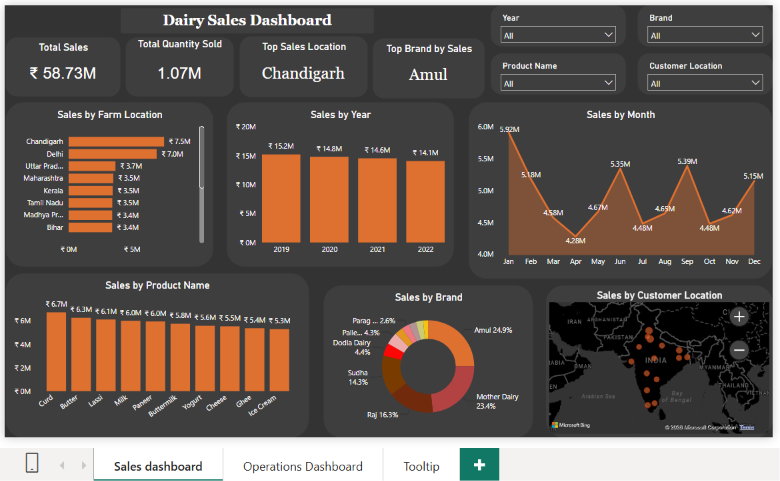
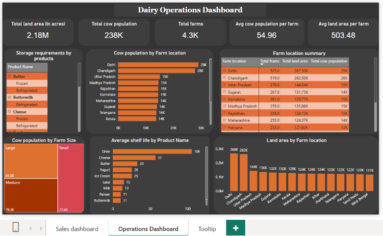

# 🥛 Dairy Goods Power BI Dashboard

## 📌 Project Overview

This project is an interactive Power BI dashboard built to analyze sales performance and operational efficiency in a dairy business.

The dashboard provides insights into revenue, product performance, farm operations, customer distribution, and key business metrics to support data-driven decision making.

---

## 🎯 Business Objectives

The dashboard helps answer questions such as:

- Which products generate the highest sales?
- Which brands contribute the most revenue?
- Which locations perform best?
- How do monthly and yearly sales compare?
- Which farms have the highest cow population?
- What are the storage requirements for different products?
- How is land distributed across farm locations?

---

## 📊 Dashboard Pages

### 1️⃣ Dairy Sales Dashboard

Provides sales performance insights including:

- Total Sales
- Quantity Sold
- Top Sales Location
- Top Selling Brand
- Sales by Product
- Sales by Brand
- Monthly Sales Trend
- Yearly Sales Trend
- Customer Location Analysis

---

### 2️⃣ Dairy Operations Dashboard

Provides operational insights including:

- Total Farm Land
- Cow Population
- Total Farms
- Average Cow Population per Farm
- Average Land per Farm
- Farm Location Summary
- Land Distribution
- Cow Population by Location
- Storage Requirements
- Product Shelf Life

---

### 3️⃣ Tooltip Page

A custom tooltip page created to provide additional details and improve dashboard interactivity.

---

## 🛠️ Tools Used

- Microsoft Power BI
- Power Query
- DAX
- Data Modeling

---

## 📷 Dashboard Preview

### Dairy Sales Dashboard

### Dairy Operations Dashboard

---

## 📁 Files Included

- Dairy Goods Analysis.pbix
- README.md
- Dashboard screenshots

---

## 👤 Author

**Abhay B H**

Aspiring Data Analyst | Power BI | SQL | Excel

GitHub:
https://github.com/Abhaybh-Analytics
